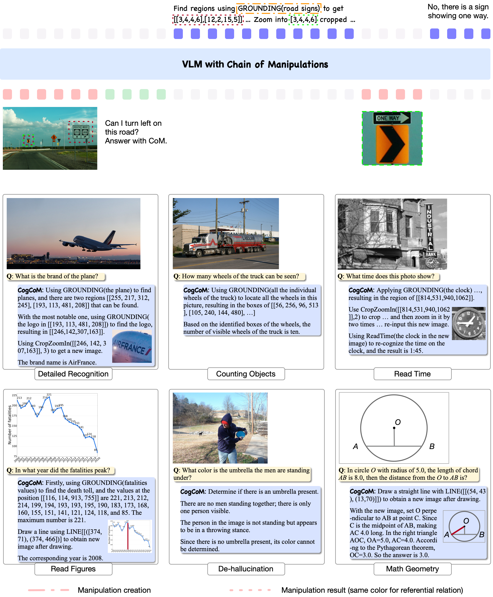

<h2 align="center"> <a href="https://arxiv.org/pdf/2402.04236">CogCoM: Train Large Vision-Language Models Diving into Details through Chain of Manipulations</a></h2>
<h5 align="center"> If you like our project, please give us a star ⭐ on GitHub for latest update.<br>

[](https://huggingface.co/qijimrc/CogCoM)
[](https://arxiv.org/pdf/2402.04236) 
[](https://github.com/THUDM/CogCoM/blob/main/LICENSE)
</h5>


<details><summary>💡 We also have other vision-language projects that may interest you ✨. </summary><p>
<!--  may -->

> [**CogVLM: Visual Expert for Pretrained Language Models**](https://github.com/THUDM/CogVLM) <br>
[](https://github.com/THUDM/CogVLM)  [](https://github.com/THUDM/CogVLM) <br>
> [**CogAgent: A Visual Language Model for GUI Agents**](https://github.com/THUDM/CogVLM) <br>
[](https://github.com/THUDM/CogVLM)  [](https://github.com/THUDM/CogVLM) <br>

</p></details>


## 📣 News

* **[2024/2/26]** 🎉 Release the base model CogCoM-chat-17b.
* **[2024/2/2]**  🎉 Release the base model CogCoM-grounding-17b.
* **[2024/2/4]**  🎉 Release the base model CogCoM-base-17b.


## 😮 Highlights

CogCoM enables VLMs to solve various visual problems step-by-step with evidence, without involving external tools.


<p align="center">

</p>


## 📖 Introduction to CogCoM

- CogCoM is a general **open-source visual language model** (**VLM**) equipped with Chain of Manipulations (CoM), wich enables VLMs to solve complex visual problems step-by-step with evidence.
- We formally design 6 basic manipulations upon the pilot experiments, which are capable of handling diverse visual problems.
- We introduce a cascading data generation pipeline based on reliable large language models (e.g., LLMs, the linguistic annotators) and visual foundational models (e.g., VFMs, the visual annotators), which can automatically produce abundant error-free training data. We collect 70K CoM samples with this pipeline. 
- We then devise a multi-turn multi-image model architecture compatible with typical VLMs structures.
- Based on a data recipe incorporating the curated corpus, we finally train a general VLM equipped with CoM reasoning mechanism, named CogCoM, which possesses capabilities of chat, captioning, grounding and reasoning.
- Please refer to our paper for details.

## 🤗 Demo

We support two GUIs for model inference, **Web demo** and **CLI**. If you want to use it in your python code, it is
easy to modify the CLI scripts for your case.

### Web Demo

Now you can use the local code we have implemented with Gradio for [GUI demo](/cogcom/demo/web_demo.py). Please switch to the directory `demo/` and run:
```bash
# Local gradio
python web_demo.py  --from_pretrained cogcom-base-17b --local_tokenizer path/to/tokenizer --bf16 --english
```


### CLI Demo

We also support interactive CLI inference using SAT. If you want to use it in your python code, it is easy to modify the CLI scripts for your case. The program will automatically download the sat model and interact in the command line (can simply using vicuna-7b-1.5 tokenizer).

```bash
# Launch an interactive environment
python cli_demo_sat.py --from_pretrained cogcom-base-17b --local_tokenizer path/to/tokenizer --bf16 --english
```

The program will automatically download the sat model and interact in the command line (can simply using vicuna-7b-1.5 tokenizer). You can generate replies by entering instructions and pressing enter. Enter `clear` to clear the conversation history and `stop` to stop the program.

We also support model parallel inference, which splits model to multiple (2/4/8) GPUs. `--nproc-per-node=[n]` in the
following command controls the number of used GPUs.

Tips:
  - If you want to manually download the weights, you can replace the path after ``--from_pretrained`` with the model
  path.

  - Our model supports SAT's **4-bit quantization** and **8-bit quantization**. You can change ``--bf16`` to ``--fp16``, or ``--fp16 --quant 4``, or ``--fp16 --quant 8``.

  For example

    ```bash
    python cli_demo_sat.py --from_pretrained cogcom-base-17b --fp16 --quant 8
    ```

  - The program provides the following hyperparameters to control the generation process:
      ```
      usage: cli_demo_sat.py [-h] [--max_length MAX_LENGTH] [--top_p TOP_P] [--top_k TOP_K] [--temperature TEMPERATURE]

      optional arguments:
          -h, --help                    show this help message and exit
          --max_length MAX_LENGTH       max length of the total sequence
          --top_p TOP_P                 top p for nucleus sampling
          --top_k TOP_K                 top k for top k sampling
          --temperature TEMPERATURE     temperature for sampling
      ```


## 🐳 Model Zoo

If you run the `demo/cli_demo*.py` from the code repository, it will automatically download SAT or Hugging Face
weights. Alternatively, you can choose to manually download the necessary weights.

  |          Model name           | Input resolution |                           Introduction                            | Huggingface model | SAT model |
  | :-------------------------: | :----: | :-------------------------------------------------------: | :------: | :-------: |
  |         cogcom-base-17b         |  490   |  Supports grounding, OCR, and CoM.   |  coming soon   |    [link](https://huggingface.co/qijimrc/CogCoM/blob/main/cogcom-base-17b.zip)        |
  |         cogcom-grounding-17b         |  490   |  Supports grounding, OCR, and CoM.   |  coming soon   |    [link](https://huggingface.co/qijimrc/CogCoM/blob/main/cogcom-grounding-17b.zip)        |
  |         cogcom-chat-17b         |  490   |  Supports chat, grounding, OCR, and CoM.   |  coming soon   |      [link](https://huggingface.co/qijimrc/CogCoM/blob/main/cogcom-chat-17b.zip)      |


## ⚙️ Requirements and Installation
We recommend the requirements as follows.
* Python == 3.11
* SwissArmyTransformer>=0.4.8
* torch>=2.1.2
* CUDA >= 11.7
* **Transformers == 4.37.0**
* **xformers == 0.0.24**
* **pydantic == 1.10.1**
* **gradio == 3.50.2**
* Install required packages:
```bash
pip install -r requirements.txt
python -m spacy download en_core_web_sm
```

> [!Warning]
> <div align="left">
> <b>
> 🚨 Please install proper version of `pydantic` for smooth inference as mentioned in [issie3](https://github.com/THUDM/CogCoM/issues/3).
> </b>
> </div>


## 🗝️ Training & Validating

### Finetuning CogCoM

You may want to use CogCoM in your own task, which needs a **different output style or domain knowledge**. **All code
for finetuning is located under at ``finetune.sh`` and ``finetune.py`` files.**


### Hardware requirement

* Model Inference:
  - For INT4 quantization: 1 * RTX 3090(24G)
  - For FP16: 1 * A100(80G) or 2 * RTX 3090(24G)

* Finetuning:
  - For FP16: 4 * A100(80G) *[Recommend]* or 8* RTX 3090(24G).


### Evaluation

<details>
<summary>Click to view results on GQA, TallyVQA, TextVQA, ST-VQA. </summary>

<table>
    <tr>
        <td>Method</td>
        <td>GQA</td>
        <td>TallyVQA-s</td>
        <td>TallyVQA-c</td>
        <td>TextVQA</td>
        <td>ST-VQA</td>
    </tr>
    <tr>
        <td>Flamingo</td>
        <td>-</td>
        <td>-</td>
        <td>-</td>
        <td>54.1</td>
        <td>-</td>
    </tr>
     <tr>
        <td>GIT</td>
        <td>-</td>
        <td>-</td>
        <td>-</td>
        <td>59.8</td>
        <td>-</td>
    </tr>
     <tr>
        <td>GIT2</td>
        <td>-</td>
        <td>-</td>
        <td>-</td>
        <td>67.3</td>
        <td>-</td>
    </tr>
    <tr>
        <td>BLIP-2</td>
        <td>44.7*</td>
        <td>-</td>
        <td>-</td>
        <td>-</td>
        <td>21.7</td>
    </tr>
    <tr>
        <td>InstructBLIP</td>
        <td>49.5*</td>
        <td>-</td>
        <td>-</td>
        <td>-</td>
        <td>50.7*</td>
    </tr>
    <tr>
        <td>Qwen-VL</td>
        <td>49.5*</td>
        <td>-</td>
        <td>-</td>
        <td>-</td>
        <td>50.7*</td>
    </tr>
    <tr>
        <td>CogCoM</td>
        <td>71.7</td>
        <td>84.0</td>
        <td>70.1</td>
        <td>71.1</td>
        <td>70.0</td>
    </tr>
</table>

</details>

<details>
<summary>Click to view results of grounding benchmarks. </summary>

<table>
    <tr>
        <td></td>
        <td>RefCOCO</td>
        <td></td>
        <td></td>
        <td>RefCOCO+</td>
        <td></td>
        <td></td>
        <td>RefCOCOg</td>
        <td></td>
    </tr>
    <tr>
        <td></td>
        <td>val</td>
        <td>testA</td>
        <td>testB</td>
        <td>val</td>
        <td>testA</td>
        <td>testB</td>
        <td>val</td>
        <td>test</td>
    </tr>
    <tr>
        <td>CogCoM-grounding-generalist</td>
        <td>92.34</td>
        <td>94.57</td>
        <td>89.15</td>
        <td>88.19</td>
        <td>92.80</td>
        <td>82.08</td>
        <td>89.32</td>
        <td>90.45</td>
    </tr>
</table>
</details>


## 🍭 Examples

CogCoM demonstrates the flexible capabilities for adapting to different multimodal scenarios, including evidential visual
reasoning, Visual Grounding, Grounded Captioning, Image Captioning, Multi Choice, and Detailed Captioning.

<p align="center">
    
</p>


## 💡 Cookbook

### Task Prompts

1. **General Multi-Round Dialogue**: Say whatever you want.

2. **Chain of Manipulations** : Explicitly launching CoM reasoning.

    - We randomly add launching prompts to the CoM chains for solving meticulous visual problems, so you can explicitly let CogCoM to run with CoM mechanism, by adding the following launching prompt (we randomly generate numerous launching prompts for flexibility, see `com_dataset.py` for all details):

    ```bash
        Please solve the problem gradually via a chain of manipulations, where in each step you can selectively adopt one of the following manipulations GROUNDING(a phrase)->boxes, OCR(an image or a region)->texts, CROP_AND_ZOOMIN(a region on given image)->new_image, CALCULATE(a computable target)->numbers, or invent a new manipulation, if that seems helpful. {QUESTION}
    ```


3. **Visual Grounding**. Our model is compatible with the grounding instructions from MultiInstruct and CogVLM, we provide basic usage of three functionalities here:

    - **Visual Grounding (VG)**: Returning grounding coordinates (bounding box) based on the description of objects. Use any template from [instruction template](cogcom/utils/template.py). For example (replacing &lt;expr&gt; with the object's description):

      > "Find the region in image that "&lt;expr&gt;" describes."

    - **Grounded Captioning (GC)**: Providing a description based on bounding box coordinates. Use a template from [instruction template](cogcom/utils/template.py). For example (replacing &lt;objs&gt; with the position coordinates),

      > "Describe the content of *[[086,540,400,760]]* in the picture."

    - **Image Description with Cooordinates (IDC)**: Image description with grounding coordinates (bounding box). Use any template
      from [caption_with_box template](https://github.com/THUDM/CogVLM/blob/main/utils/utils/template.py#L537) as model
      input. For example:

      > Can you provide a description of the image and include the coordinates [[x0,y0,x1,y1]] for each mentioned object?
    
**Format of coordination:** The bounding box coordinates in the model's input and output use the
format ``[[x1, y1, x2, y2]]``, with the origin at the top left corner, the x-axis to the right, and the y-axis
downward. (x1, y1) and (x2, y2) are the top-left and bottom-right corners, respectively, with values as relative
coordinates multiplied by 1000 (prefixed with zeros to three digits).


### FAQ

* If you have trouble in accessing huggingface.co, you can add `--local_tokenizer /path/to/vicuna-7b-v1.5` to load the
  tokenizer.
* Download model using 🔨[SAT](https://github.com/THUDM/SwissArmyTransformer), the model will be saved to the default
  location `~/.sat_models`. Change the default location by setting the environment variable `SAT_HOME`. For example, if
  you want to save the model to `/path/to/my/models`, you can run `export SAT_HOME=/path/to/my/models` before running
  the python command.

## 🔒 License

The code in this repository is open source under the [Apache-2.0 license](./LICENSE), while the use of the CogCoM model
weights must comply with the [Model License](./MODEL_LICENSE).

## ✒️ Citation & Acknowledgements

```
@article{qi2024cogcom,
  title={CogCoM: Train Large Vision-Language Models Diving into Details through Chain of Manipulations},
  author={Qi, Ji and Ding, Ming and Wang, Weihan and Bai, Yushi and Lv, Qingsong and Hong, Wenyi and Xu, Bin and Hou, Lei and Li, Juanzi and Dong, Yuxiao and Tang, Jie},
  journal={arXiv preprint arXiv:2402.04236},
  year={2024}
}
```